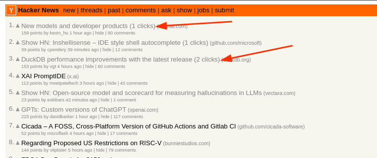

# Link Clicks Counter

Minimal Browser Extension to track link clicks and display the count in a badge.

> Might not be fully functional. Use at your own risk.

## Installation
- Download this repo as a zip file and extract it.
- Open the Extension Management page by navigating to `chrome://extensions`.
- Enable Developer Mode by clicking the toggle switch next to **Developer mode**.
- Click the **LOAD UNPACKED** button and select the extension directory.

## Sample

